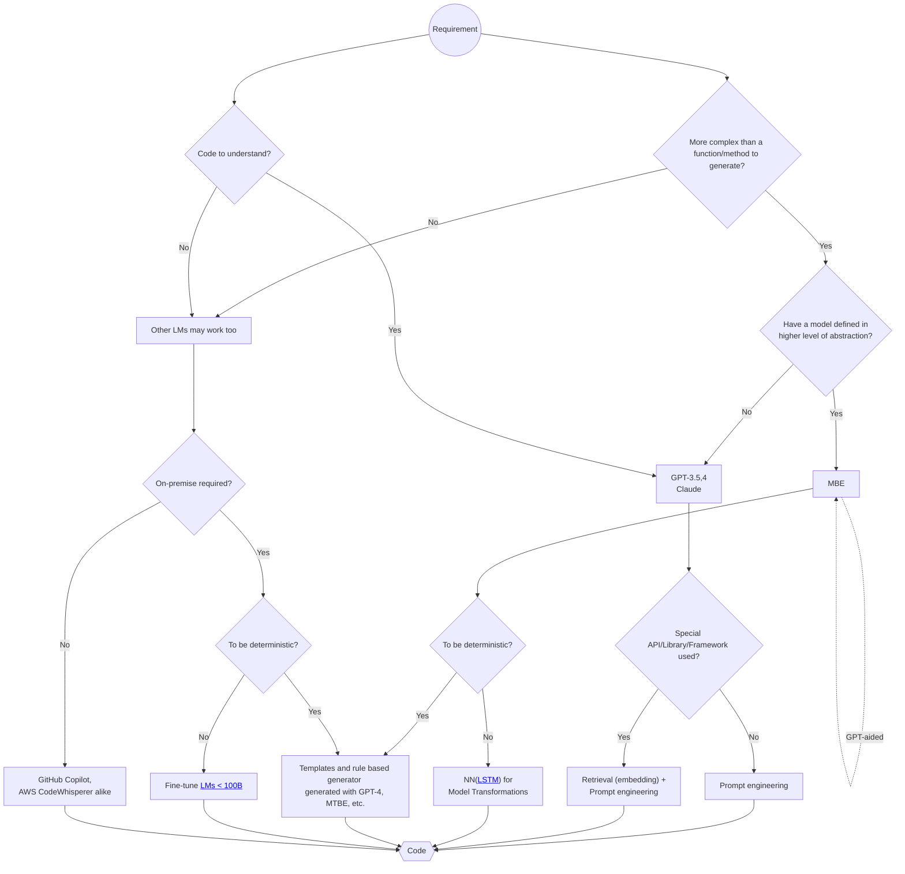

# All Roads Lead To Code in the age of AI
    

```mermaid
graph TD;
    S((Requirement))-->Q1{"More complex than a \nfunction/method to generate?"};
    S-->Q2{Code to understand?};
    Q1 -- Yes --> Q1a{"Have a model defined in \nhigher level of abstraction?"}
    Q1a -- No --> P1["GPT-3.5,4\nClaude"];
    Q1a -- Yes --> P100[MBE]
    P100 -. GPT-aided .-> P100
    P100 --> Q1b{To be deterministic?} 
    Q1b -- No --> P12["NN(<a target='_blank' href='https://modeling-languages.com/lstm-neural-network-model-transformations/'>LSTM</a>) for \nModel Transformations"]
    Q1b -- Yes --> P21
    Q1 -- No -->P2[Other LMs may work too];
    Q2 -- Yes -->P1
    Q2 -- No -->P2;
    P1 --> Q3{"Special \nAPI/Library/Framework used?"};
    Q3 -- No -->P10[Prompt engineering];
    Q3 -- Yes -->P11["Retrieval (embedding) + \nPrompt engineering"];
    P2 --> Q4{On-premise required?};
    Q4 -- Yes --> Q5{To be deterministic?};
    Q4 -- No --> P23["GitHub Copilot, \nAWS CodeWhisperer alike"]
    Q5 -- Yes --> P21["Templates and rule based generator \ngenerated with GPT-4, MTBE, etc."]
    Q5 -- No --> P22["Fine-tune <a href='https://github.com/AI-LLM/ai-llm.github.io/blob/main/Code-LLM-alternatives.md'>LMs < 100B</a>"]
    P10 --> Code{{Code}}
    P11 --> Code
    P12 --> Code
    P21 --> Code
    P22 --> Code
    P23 --> Code
```
