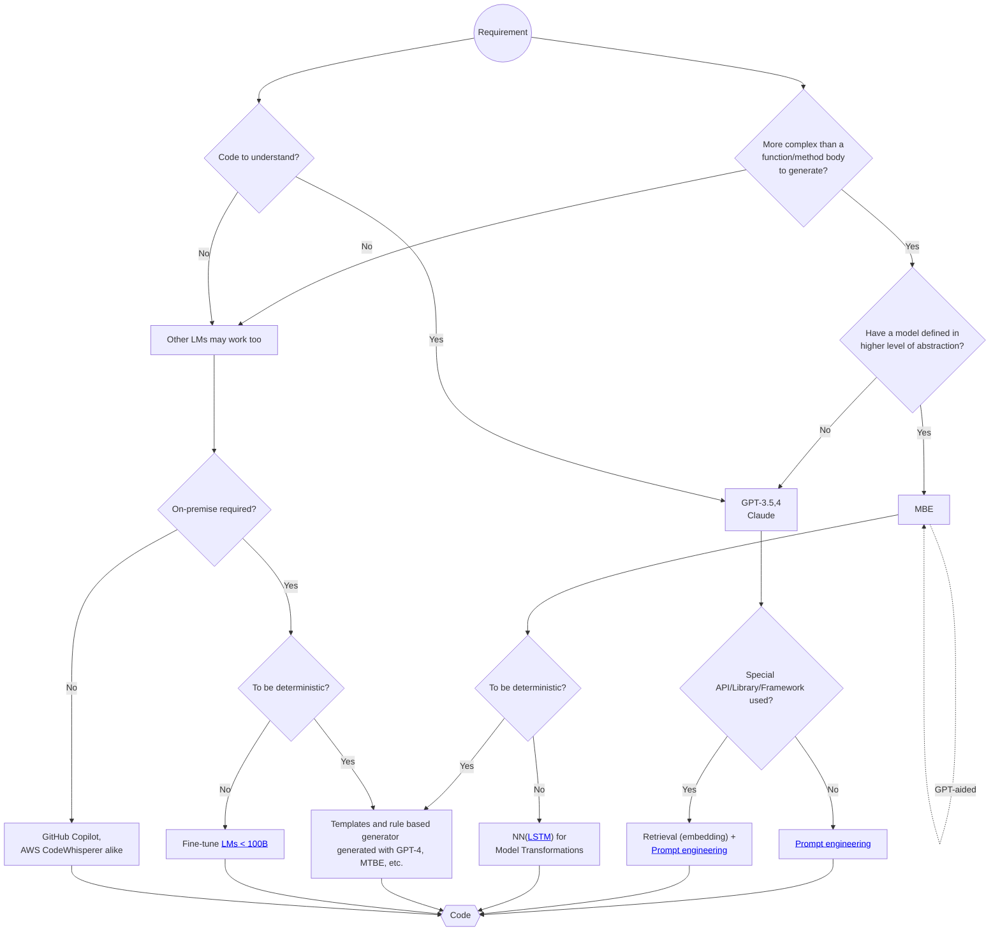
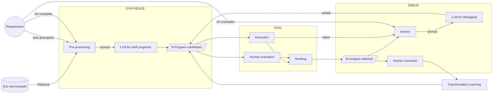

# All Roads Lead To Code in the age of AI 条条大路通代码

The way of expressing the **Requirement** is needed to be studied with the level of abstraction varying from user story and use case to docstring and comments.

**Metrics** are also needed to measure the benefits of using LLM for code generation, like *length of prompt to length of generated code*, etc.

代码生成领域的需求痛点：
1. 实用化的评测缺失
   1. **需求**以何种方式表达？从user story, use case到函数签名和注释，抽象程度差异很大。
      

        
ideas

        利用LLM提高抽象程度的核心思想可以是：让LLM来补全缺失的细节。根据它掌握的上下文知识，还不足的反过来问用户。这样才能最大程度地降低认知负担，提高人的生产效率。怎么尽量避免它乱猜？可以找(Semantic search)相应地设计模式或样板代码让它<a href="https://github.com/AI-LLM/ai-llm.github.io/blob/main/doc-code.md">参照</a>，发现需要什么细节信息，用户当前的prompt里和上下文里有没有？有就自己填进去，没有再问用户要。
      
    
   2. 基于应用目标的**评价指标**，比如评价 *程序员编码的效率* 可计算 *生成代码长度与prompt键入长度的比值*，等等。
2. 使用公共大模型的信息泄漏问题，除了改用内部部署小模型外还有什么办法？
   1. [Anonymization](https://github.com/AI-LLM/AnonymizedGPT) (WIP)
   2. [Use of dummies](https://privacypatterns.org/patterns/Use-of-dummies)
3. 训练coding小模型的难点
   1. 除了1，似乎数据已经耗尽了也是个大问题，github用完了还有什么办法?
      1. 用chatgpt生成
      2. 基于规则的合成，参考[法律NER的经验](https://towardsdatascience.com/why-we-switched-from-spacy-to-flair-to-anonymize-french-legal-cases-e7588566825f)和[医疗领域经验](https://xamat.medium.com/data-as-prior-innate-knowledge-for-deep-learning-models-23898363a71a)。
   2. 13B的CodeGen和CodeGeex基本耗尽了Java、C++等热门编程语言数据，但是[跟ChatGPT还是有不小的差距](Code-LLM-alternatives.md)，那么
      1. Fine tune 13B with 高质量专有数据集，能达到什么效果？
      2. 增加world knowledge训练13B或以上模型，成本对多数企业不现实。而且于以上1有关。
      3. <13B的模型，但只训练一种编程语言，能接近chatgpt吗？
4. 最新的代码、文档不会运用
5. 高阶技术（训练数据中出现少，或者需要复杂的推理过程才能找到正确的方案）不会运用
6. 其他生成代码的缺陷类型和分布与[人类程序员相似](https://arxiv.org/abs/2205.10583)

