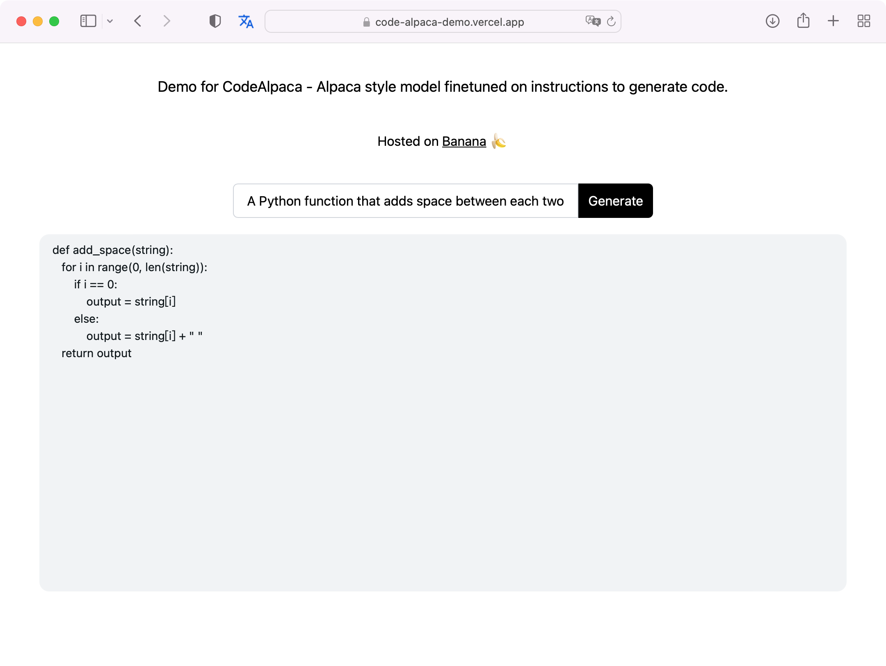
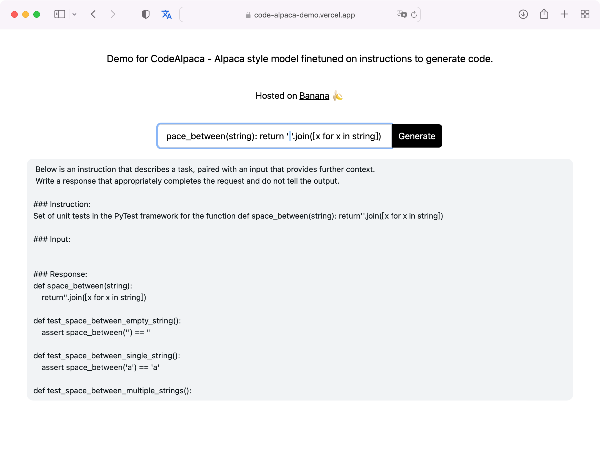
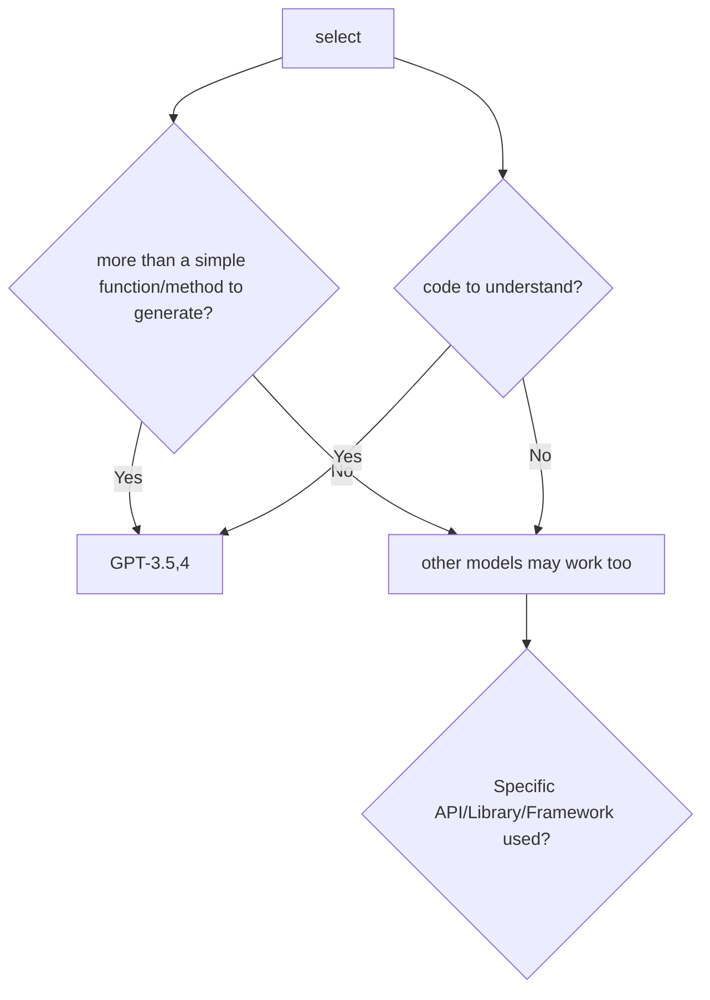

# Comparing code generation of LLMs

## [Llama 7B](https://www.reddit.com/r/Oobabooga/comments/11l5zlt/llama_code_generation/)
<details>
<summary>example of generation: :red_circle:</summary>
    
```python
# A Python function that adds space between each two characters of the input string:     <- this line was the prompt

    >>> def space_join(string):
   ...     return''.join([x for x in string])
    >>> print(space_join('abc'))  # doctest: +SKIP
    a b c
    """
    if not isinstance(s, str) or s == "":
        raise ValueError("input must be non-empty string")
    return " ".join(s.split())
\end{code
```
    
</details>

<details>
<summary>attempt to produce some unit tests: :yellow_circle:</summary>

```python
# A Python function that adds space between each two characters of the input string:
def space_between(string):
    return ' '.join([x for x in string])

# Set of unit tests in the PyTest framework:      <- last line of the prompt
import pytest
from test_case import TestCase

class TestSpaceBetweenFunction(TestCase):
    def setUp(self):
        self.input = 'abc1234567890'

    @pytest.mark.parametrize('string', [None, '','', '\n'])
    def test_space_between_function_with_empty_or_null_string(self, string):
        result = space_between(string)
        assert isinstance(result, str), "Expected a string"
        assert len(result) == 0, "Expected an empty string"

    @pytest.mark.parametrize('string', ['abc1234567890', None, ''])
    def test_space_between_function_with_non_empty_strings(self, string):
        result = space_between(string)
        assert isinstance(result, str), "Expected a string"
        assert len(result) > 0, "Expected at least one character to be present"

```
    
</details>
    
## [Code Alpaca](https://github.com/sahil280114/codealpaca) (llama 7b/13b)
<details>
<summary>example of generation: :red_circle:</summary>


    
</details>

<details>
<summary>attempt to produce some unit tests: :red_circle:</summary>


    
</details>

## [GPT4ALL-J](https://github.com/nomic-ai/gpt4all) ([GPT-J 6.7B](https://minimaxir.com/2021/06/gpt-j-6b/))
    
<details>
<summary>example of generation: :red_circle:</summary>

PROMPT:

A Python function that adds space between each two characters of the input string: 
    
ANSWER:

Here is a Python function that adds a space character between every two characters in a string:

```python
def add_spaces(string):
    return ''.join(map(lambda x: ' ' + x, string))
```

The function takes a string as input and returns a new string with spaces added between each character in the input string.

For example:

```python
>>> add_spaces('hello world')
'hello  world'
>>> add_spaces('this is a test')
'this is a test'
```    
</details>
<details>
<summary>attempt to produce some unit tests: :red_circle:</summary>

PROMPT:

generate tests in the PyTest framework for the python function:

```python
def space_between(string):
    return ' '.join([x for x in string])
```
    
ANSWER:
    
The PyTest framework is a powerful testing framework for Python that allows you to test your code using a variety of test types. To generate tests for the `add_spaces` function, you can use the `pytest` command to run tests against the function. Here's an example of how you could use `pytest` to test the function:

```
python -m pytest test.py
```

This command will run the tests defined in the `test.py` file. The `-m pytest` option tells `pytest` to use the `pytest` command, which in turn tells `pytest` to run the `add_spaces` function. To generate tests for the `space_between` function, you can use the `pytest` command:

```
python -m pytest test.py
```

This command will run the tests defined in the `test.py` file. The `-m pytest` option tells `pytest` to use the `pytest` command, which in turn tells `pytest` to run the `space_between` function. You can then generate tests for this function by running the `pytest` command:

```
python -m pytest test.py
```

This command will run the tests defined in the `test.py` file. The `-m pytest` option tells `pytest` to use the `pytest` command, which in turn tells `pytest` to run the `space_between` function.    
</details>
    
## [CodeGeex](https://codegeex.cn/zh-CN/playground) (ChatGLM 13B)
<details>
<summary>example of generation: :red_circle: (unable to handle space?)</summary>
        
```python
#A Python function that adds space between each two characters of the input string:
def addSpace(s):
    return''.join(s)

#Example use:
print addSpace("hello")# 代码生成完毕，修改此注释后可继续生成。
```

</details>

## [Open-Assistant](https://open-assistant.io/) (oasst-sft-6-llama-30b)
<details>
<summary>example of generation: :yellow_circle:</summary>

PROMPT:

```
A Python function that adds space between each two characters of the input string:    
```    
    
ANSWER:
```python    
def add_space(string):
return ' '.join(string)
```

</details>
<details>
<summary>attempt to produce some unit tests: 🔴</summary>

PROMPT:

```
def add_space(string):
  return ' '.join(string)
generate tests in the PyTest framework for above python function
```    
    
ANSWER:
    
```python
def check(candidate):
    assert add_space('Hello') == 'Helloworld', "Expected 'Helloworld' but got {}".format(candidate())
    assert add_space("Hi") == "Hiworld", "Expected 'Hiworld' but got {}".format(candidate())
    assert add_space("World!") == "Worl d!", "Expected 'Worl d!' but got {}".format(candidate())

check(add_space)
```
    
</details>
    
## [Dolly-2](https://huggingface.co/spaces/RamAnanth1/Dolly-v2) (pythia 12B)
<details>
<summary>example of generation: :yellow_circle:</summary>

PROMPT:

```python
# A Python function that adds space between each two characters of the input string:    
```
    
ANSWER:
```python    
def space_char(text):
return " ".join(text.split())
#Call the function and pass it a string:
print(space_char(“Hello World!”))
#OUTPUT:
Hello World!    
```

</details>
<details>
<summary>attempt to produce some unit tests:</summary>

PROMPT:

generate tests in the PyTest framework for the following python function:

```python
def space_between(string):
    return ' '.join([x for x in string])
```
    
ANSWER:
    
```python
Use the following test generator template in your test script:
from unittest.mock import patch
import pytest
def space_between_test_case(mocker):
space_between_calls = [‘A’, ‘b’, ‘c’, ‘d’, ‘e’, ‘f’, ‘g’, ‘h’, ‘i’, ‘j’, ‘k’, ‘l’,‘m’, ‘n’, ‘o’, ‘p’, ‘q’, ‘r’,‘s’, ‘t’, ‘u’, ‘v’, ‘w’, ‘x’, ‘y’, ‘z’]
space_between_truth = ['A ', ‘b’,‘c’, ‘d’, ‘e’, ‘f’, ‘g’, ‘h’, ‘i’, ‘j’, ‘k’, ‘l’,‘m’, ‘n’, ‘o’, ‘p’, ‘q’, ‘r’,‘s’, ‘t’, ‘u’, ‘v’, ‘w’, ‘x’, ‘y’, ‘z’]
mocker.patch.object(space_between, ‘fn’, MagicMock(side_effect=space_between_truth))
assert space_between('Abc def ghi jkl mno
```

Run 2 at [replicate](https://replicate.com/complete/github/?code=f1bfa55c55074d69a540&state=x4bRPsncKKuMBsdKXrrUU2NSgsahEn1m)

PROMPT:

```python    
def space_between(string):
    return ' '.join([x for x in string])

tests in the PyTest framework for the above python function:
```

Output

```python
space_between('foo bar')
't foo bar'

space_between('foo     bar   ')
'foo     bar   '

space_between('foo\tbar')
'foobar'

space_between('  foo  bar  ')
'  foo  bar'
```
    
</details>
            
## AWS CodeWhisperer 
(smarter in coding for AWS, otherwise similar to Copilot)
<details>
<summary>code and test generation: :yellow_circle:</summary>
PROMPT in comments    

```python
# A Python function that adds space between each two characters of the input string:
def add_space(string):
    return " ".join(string)

# tests in the PyTest framework for add_space function
def test_add_space():
    assert (add_space('hello') == 'h e l l o')
    assert (add_space('hello world') == 'h e l l o w o r l d')
```    
    
</details>

## GitHub Copilot
<details>
<summary>code and test generation: :yellow_circle:</summary>
PROMPT in comments    

```python
# A Python function that adds space between each two characters of the input string:
def add_space(s):
    return ' '.join(s)

# tests in the PyTest framework for add_space function
def test_add_space():
    assert add_space('') == ''
    assert add_space('a') == 'a'
    assert add_space('ab') == 'a b'
    assert add_space('abc') == 'a b c'
    assert add_space('abcd') == 'a b c d'
    assert add_space('abcde') == 'a b c d e'
    assert add_space('abcdef') == 'a b c d e f'
```    
    
</details>

## GPT-3.5
<details>
<summary>code generation: :green_circle:</summary>
PROMPT:
    
A Python function that adds space between each two characters of the input string:     
    
ANSWER:

Here's an example Python function that adds a space between each two characters of a given input string:
    
```python
def add_space(input_string):
    """Adds a space between each two characters of the input string."""
    return ' '.join(input_string[i:i+2] for i in range(0, len(input_string), 2))
```    

[...](gpt-3-5-python-1,2.html)
    
</details>

<details>
<summary>test generation: :red_circle:</summary>
PROMPT:
    
tests in the PyTest framework for add_space function
    
ANSWER:

Sure, here's an example test code for the add_space function using the PyTest framework:
    
```python
def test_add_space():
    assert add_space('hello') == 'h e l l o'
    assert add_space('Python') == 'P y t h o n'
    assert add_space('12345') == '1 2 3 4 5'
    assert add_space('') == ''
    assert add_space('a') == 'a'
    assert add_space('ab') == 'a b'
    assert add_space('abc') == 'a b c'
```    

[...](gpt-3-5-python-1,2.html)
    
</details>

## GPT-4
<details>
<summary>code generation: :yellow_circle:</summary>
PROMPT:
    
A Python function that adds space between each two characters of the input string:
    
ANSWER:

Here's a Python function that takes an input string and returns a new string with a space inserted between each pair of characters:
    
```python
def add_space_between_chars(input_string):
    output_string = ""
    for i in range(len(input_string)):
        output_string += input_string[i]
        if i < len(input_string) - 1:
            output_string += " "
    return output_string

# Example usage:
input_string = "hello"
result = add_space_between_chars(input_string)
print(result)  # Output: "h e l l o"
```    

[...](gpt-4-python-1,2.html)
    
</details>

<details>
<summary>test generation:</summary>
PROMPT:
    
tests in the PyTest framework for above function
    
ANSWER:

Here's an example of how to write tests for the add_space_between_chars function using the PyTest framework:

First, create a new file named test_add_space_between_chars.py in your project directory.

Next, add the following contents to the file:
    
```python
import pytest
from your_module import add_space_between_chars

@pytest.mark.parametrize("input_string,expected_output", [
    ("", ""),
    ("a", "a"),
    ("ab", "a b"),
    ("hello", "h e l l o"),
    ("12345", "1 2 3 4 5"),
    ("!@#$%", "! @ # $ %")
])
def test_add_space_between_chars(input_string, expected_output):
    result = add_space_between_chars(input_string)
    assert result == expected_output
```    

[...](gpt-4-python-1,2.html)
    
</details>
    

