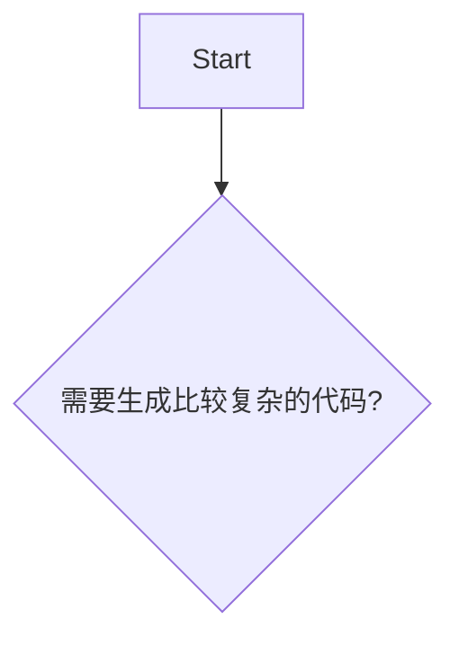

# 大语言模型的代码生成能力调研

## [Llama 7B](https://www.reddit.com/r/Oobabooga/comments/11l5zlt/llama_code_generation/)
<details>
<summary>example of generation:</summary>
    
```python
# A Python function that adds space between each two characters of the input string:     <- this line was the prompt

    >>> def space_join(string):
   ...     return''.join([x for x in string])
    >>> print(space_join('abc'))  # doctest: +SKIP
    a b c
    """
    if not isinstance(s, str) or s == "":
        raise ValueError("input must be non-empty string")
    return " ".join(s.split())
\end{code
```
    
</details>

<details>
<summary>attempt to produce some unit tests:</summary>

```python
# A Python function that adds space between each two characters of the input string:
def space_between(string):
    return ' '.join([x for x in string])

# Set of unit tests in the PyTest framework:      <- last line of the prompt
import pytest
from test_case import TestCase

class TestSpaceBetweenFunction(TestCase):
    def setUp(self):
        self.input = 'abc1234567890'

    @pytest.mark.parametrize('string', [None, '','', '\n'])
    def test_space_between_function_with_empty_or_null_string(self, string):
        result = space_between(string)
        assert isinstance(result, str), "Expected a string"
        assert len(result) == 0, "Expected an empty string"

    @pytest.mark.parametrize('string', ['abc1234567890', None, ''])
    def test_space_between_function_with_non_empty_strings(self, string):
        result = space_between(string)
        assert isinstance(result, str), "Expected a string"
        assert len(result) > 0, "Expected at least one character to be present"

```
    
</details>
    
## [Code Alpaca](https://github.com/sahil280114/codealpaca) (llama 7b/13b)
<details>
<summary>example of generation:</summary>


    
</details>

<details>
<summary>attempt to produce some unit tests:</summary>


    
</details>

## [CodeGeex](https://codegeex.cn/zh-CN/playground) (ChatGLM 13B)
<details>
<summary>example of generation:</summary>
        
```python
#A Python function that adds space between each two characters of the input string:
def addSpace(s):
    return''.join(s)

#Example use:
print addSpace("hello")# 代码生成完毕，修改此注释后可继续生成。
```

</details>
    
## [Dolly-2](https://huggingface.co/spaces/RamAnanth1/Dolly-v2) (pythia 12B)
<details>
<summary>example of generation:</summary>

```python
def space_char(text):
return " ".join(text.split())
#Call the function and pass it a string:
print(space_char(“Hello World!”))
#OUTPUT:
Hello World!    
```

</details>
    
## [GPT4ALL-J](https://github.com/nomic-ai/gpt4all) (GPT-J 6.7B)
    
...seems better (becuz [GPT-J is not bad](https://minimaxir.com/2021/06/gpt-j-6b/)?)


