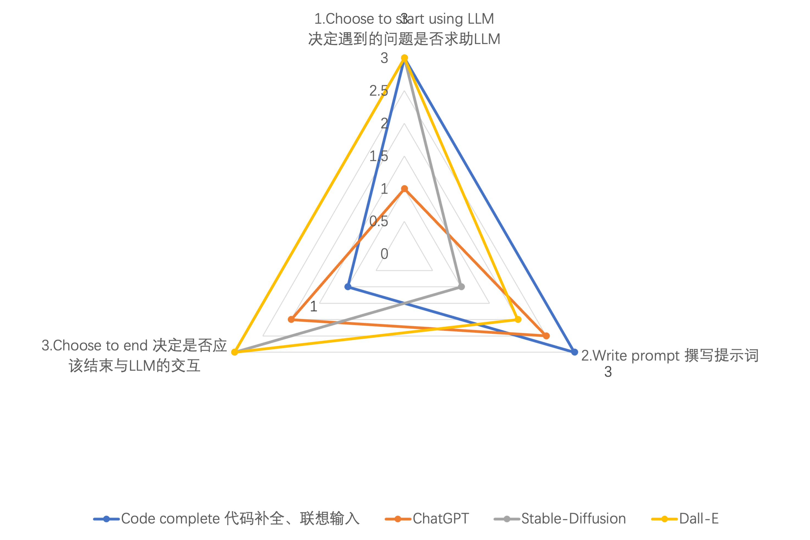

#LLM Usage Assement

1. Choose to start using LLM
    1. Always active generation (3) ⇠ Needs to handle:
        * Privacy
        * Speed, energy consumption
    2. Automatic judgment (2)⇠ Experience with specific models is helpful in achieving:
        * Ability assessment
        * Speed assessment
        * Semantic-based cache
        * Synchronous testing of other models, comparison with GPT-4
    3. Manual judgment (1-3)
        * Capabilities that the target users lack, or the extent of the gap
2. Writing prompts
    1. Auto-generation (3)
    2. Difficulty in manual writing (1)
3. Choose to end the interaction with LLM — trying to improvement may introduce more errors, diminishing returns
    1. Automatic judgment (3)
        * Test code available
    2. Assisted judgment (2)
        * Reducing the burden of code reading comprehension
            - ChatGPT's ability to explain code is stronger than beginners
            - Lack of evaluation tests for LLM's code explanation capabilities
        * Generating multiple versions for comparison may help in result convergence
        * Use and handling of the context window
    3. Manual judgment (1-3)
        * Intuitiveness of the results

(In Chinese)

1. 决定遇到的问题是否求助LLM
    1. LLM始终主动生成（3） ⇠ 需解决：
        * 隐私
        * 速度、能耗
    2. 自动判断 （2）⇠ 对特定模型的历史经验有助于实现：
        * 能力的判断
        * 速度的判断
        * 基于语义的cache
        * 同步测试其他模型，与GPT-4对比
    3. 人工判断（1-3）
        * 目标用户不具备的能力，或差距的大小
2. 撰写提示词
    1. 自动生成（3）
    2. 人工撰写之难易（1）
3. 决定是否应该结束与LLM的交互——改进可能引入更多错误，效用递减
    1. 自动判断（3）
        * 有测试代码
    2. 辅助判断（2）
        * 降低代码阅读理解负担
            - ChatGPT解释代码能力强于初学者
            - 缺乏对LLM代码解释能力的评估测试
        * 产生多个版本来比较可能有助于结果的收敛
        * context window的使用情况和处理
    3. 人工判断（1-3）
        * 结果的直观程度
        
