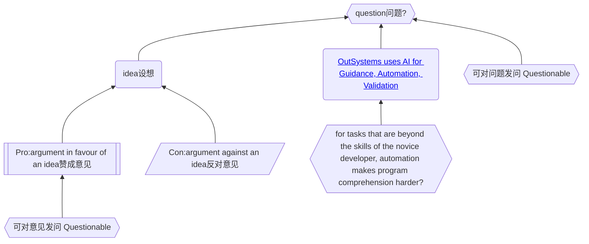

# LLM for Software Engineering as a Wicked Problem

LLM's impact on software industry is more than AI assistance. 
This is an initiative to collaborativly construct its comprehension, methodologies and meanings.  

